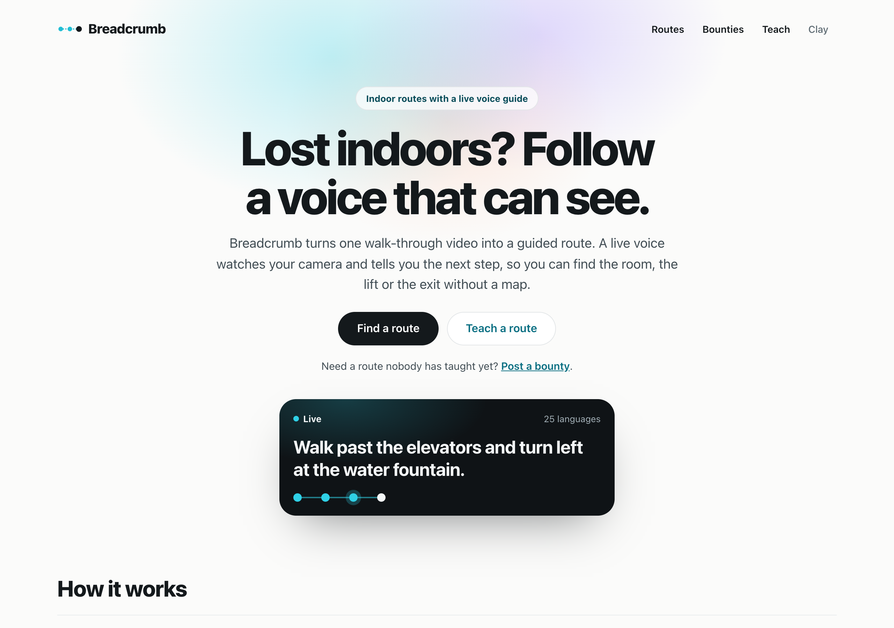
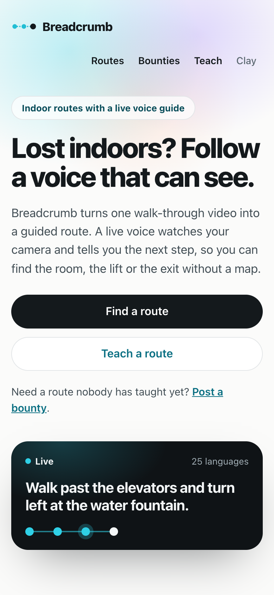
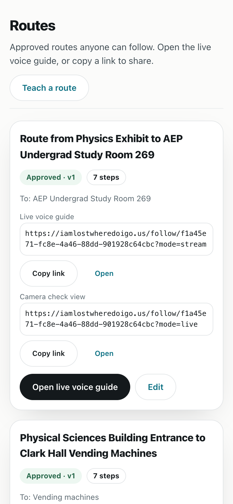
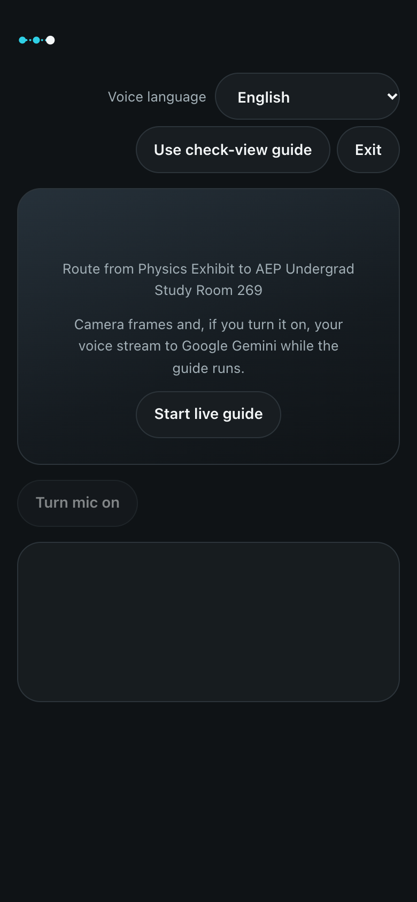
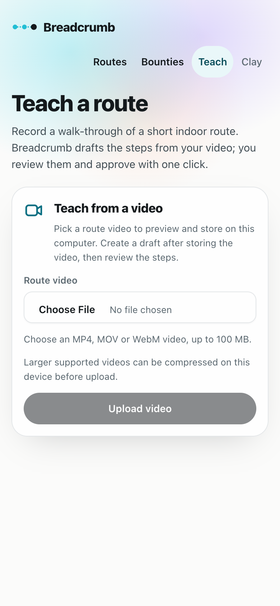
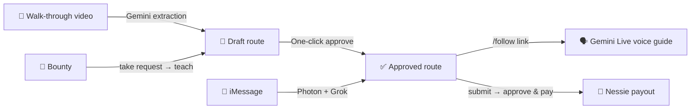

<div align="center">

# 🍞 Breadcrumb

**Lost indoors? Follow a voice that can see.**

Teach a short indoor route once with a walk-through video. Anyone can then follow it with a live voice guide that watches their camera.

[](https://iamlostwheredoigo.us)


<br>




</div>

## ✨ What it does

| | |
|---|---|
| 🎥 **Teach** | Upload one walk-through video. Gemini drafts the checkpoints; you review and **approve in one click**. |
| 🗣️ **Follow** | Open the link on a phone. A **Gemini Live** voice guide watches the camera and says where to go next, in **25 languages**. |
| 💬 **Text** | Message the **iMessage agent** (Photon) “how do I get to the study room?”. **Grok** picks the route and replies with the link. |
| 💸 **Earn** | Post a **bounty** for a route you need. A creator teaches it, the poster approves, and payout goes through **Capital One Nessie** (sandbox money). |

<p align="center">
  
  
  
  
</p>

## 🧭 How it works



- **Safe by design:** guidance comes only from an approved, immutable route version. No direction is shown before the approach is confirmed, and nothing silently falls back to fake data.
- **Keys stay on the server:** the browser gets a short-lived, route-locked Gemini Live token. Live sessions and bounties are rate-limited.

## 🚀 Quick start

> Requires **Node ≥ 22.18** (tested on 24.11.1).

```sh
npm install
# add your keys to .env.local (see the table below)
npm run dev                  # http://localhost:3000
# production: npm run build && npm start
```

Each provider is off until its flag and key are set. Without them, the matching feature says it is not available.

| Feature | Env |
|---|---|
| 🎥 Video → draft | `BREADCRUMB_GEMINI_EXTRACTION=1`, `GEMINI_API_KEY` |
| 🗣️ Live voice guide | `BREADCRUMB_GEMINI_LIVE=1`, `GEMINI_API_KEY` |
| 📷 Camera check view (`/follow/<id>?mode=live`) | `BREADCRUMB_GEMINI_RECOGNITION=1`, `GEMINI_API_KEY` |
| 💬 iMessage agent | `BREADCRUMB_AGENT=1`, `XAI_API_KEY`, `BREADCRUMB_AGENT_SECRET`, `BREADCRUMB_PUBLIC_URL`, `SPECTRUM_PROJECT_ID`, `SPECTRUM_PROJECT_SECRET` → run `npm run photon-agent` |
| 💸 Bounties | `BREADCRUMB_BOUNTIES=1`, `NESSIE_API_KEY`, `NESSIE_FUNDING_ACCOUNT_ID`; optional `NESSIE_PAYOUT_MODE` (`auto` default, `transfer`, `ledger`) |
| 🔊 ElevenLabs voice (camera view) | `BREADCRUMB_ELEVENLABS_VOICE=1`, `ELEVENLABS_API_KEY`; optional `ELEVENLABS_VOICE_ID` |

Keep keys in an ignored `.env.local`; never commit them. Phones need **HTTPS** for the camera and microphone; use a tunnel such as Cloudflare Tunnel or ngrok.

## 🧪 Checks

Scripts that start a server need `npm run build` first.

| Command | Purpose |
|---|---|
| `npm run check` | Unit checks for core rules, media, extraction, live guide, agent, Nessie and bounties (no network) |
| `npm run typecheck` | `tsc --noEmit` |
| `node scripts/smoke-api.mjs` | HTTP walk-through on an isolated server |
| `node scripts/follow-camera.check.mjs` | Headless Chrome guide checks at 390 and 1280 px (macOS Chrome path) |
| `node scripts/screenshots.mjs` | Regenerates `docs/screenshots/` |

Test scripts use their own temporary data and the `BREADCRUMB_TEST_FIXTURES=1` flag. They never touch your `.data/`.

## 🗂️ Project map

| Path | What lives there |
|---|---|
| `src/app/` | Pages (`/`, `/teach`, `/follow/[routeId]`, `/bounties`, `/routes` → `/#routes`) and API routes |
| `src/features/` | Landing, creator and guide UI |
| `src/server/` | Core navigation rules, Gemini, live tokens, agent, Nessie, bounties |
| `contracts/` | Shared types and zod schemas |
| `knowledge/` | [Architecture](knowledge/architecture.md), [design system](knowledge/design-system.md), [product brief](knowledge/product.md) and [reuse and licenses](knowledge/reuse.md) |
| `archive/` | Build-process notes from the hackathon (multi-agent workflow, stage receipts, verification evidence); [not needed to run the app](archive/README.md) |

Contributors and coding agents: see [AGENTS.md](AGENTS.md).

## ⚠️ Limits

- 🧪 Hackathon build: one Node process with a local JSON store and local media. There are no accounts; anyone with the URL can edit routes.
- 💵 Bounty payouts use **Nessie sandbox** money, and the sandbox does not update balances.
- 📱 Real-phone navigation accuracy is still being tested on real routes.

## 📄 License

[MIT](LICENSE) © 2026 The Breadcrumb team (BigRed 2026).
